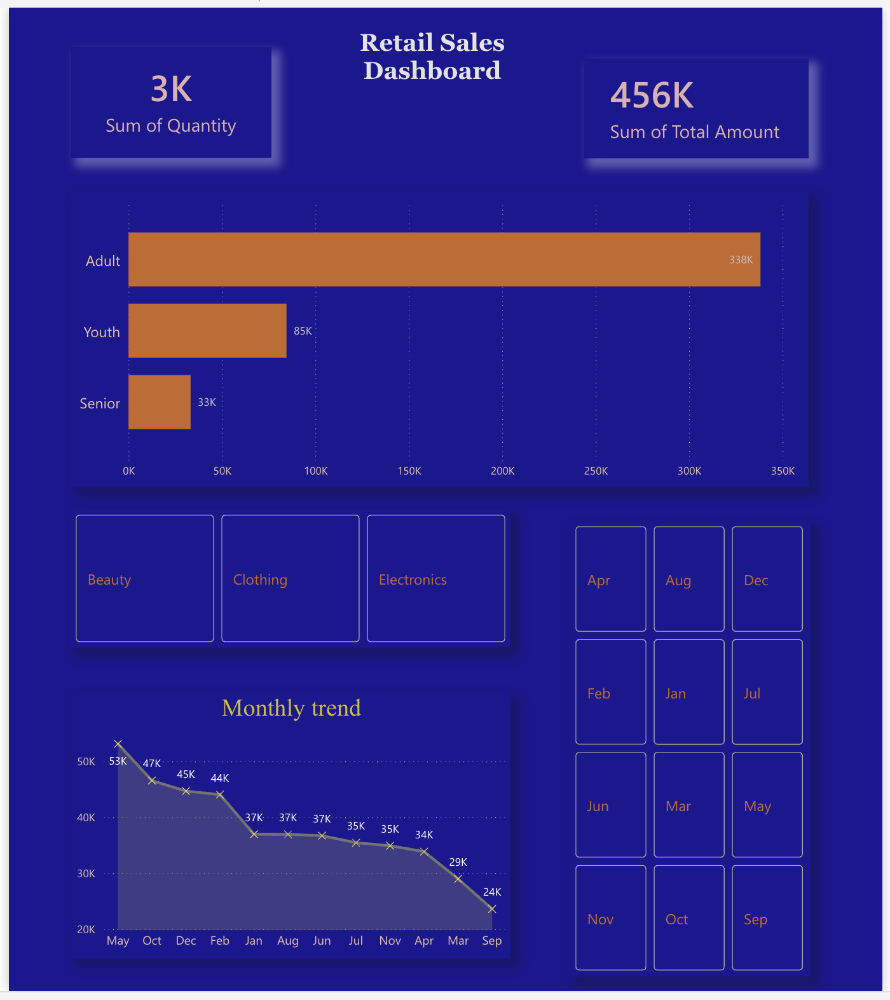

# 📊 Retail Sales Analysis Dashboard

## 📌 Project Overview
This project analyzes retail sales data to understand customer behavior, product performance, and seasonal trends. The analysis was performed using Excel and Power BI to generate meaningful business insights.

---

## 🛠 Tools Used
- Microsoft Excel (Data Cleaning, Pivot Tables, Charts)
- Power BI (Interactive Dashboard)

---

## 📂 Dataset
The dataset contains:
- Customer Age Group (Youth, Adult, Senior)
- Product Categories (Beauty, Clothing, Electronics)
- Monthly Sales Data
- Quantity and Total Amount

---

## 📊 Dashboard Preview

---

## 📈 Business Questions & Insights

### 1️⃣ How does customer age influence purchasing behavior?
- Adult customers (25–45 years) contribute the highest share in total sales (~338K)
- Youth customers contribute moderate sales (~85K)
- Senior customers contribute the least (~33K)

👉 **Conclusion:** Adults are the primary target customer segment.

---

### 2️⃣ Are there patterns in sales across time?
- Sales peak in **May (53K), October, and December**
- Sales drop to lowest in **September (24K)**

👉 **Conclusion:** Strong seasonal trends exist in sales.

---

### 3️⃣ Which product categories have highest appeal?
- Clothing category has the highest total sales (~894 units)
- Electronics and Beauty follow behind

👉 **Conclusion:** Clothing is the most preferred category.

---

### 4️⃣ Relationship between age, spending, and product preference
- Adults spend more across all product categories
- Youth and Seniors have lower spending patterns
- All age groups show higher interest in Clothing

👉 **Conclusion:** Adults dominate purchasing across categories.

---

### 5️⃣ How do customers adapt to seasonal trends?
- Higher spending during festive/peak months
- Reduced spending in off-season months

👉 **Conclusion:** Customer buying behavior is highly seasonal.

---

## 💡 Key Insights
- Adults are the highest revenue-generating segment
- Clothing is the most demanded product category
- Peak sales occur in May, October, and December
- Lowest sales occur in September
- Seasonal trends significantly impact sales

---

## 📌 Business Recommendations
- Increase stock during peak months (May, October, December)
- Focus marketing on adult customers
- Prioritize clothing category for maximum revenue

---

## 🚀 Conclusion
This project demonstrates how data analysis and visualization can help businesses make data-driven decisions in marketing, inventory management, and customer targeting.
